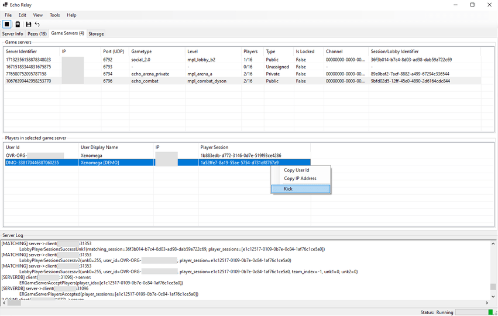

# EchoRelay.App

This is a simple/rough C#.NET WinForms app which demonstrates some of the capabilities of `EchoRelay.Core` by offering a visual configuration and operation of central services.

To install this component, read the installation instructions within the solution's [README](../README.md).

## Features

`EchoRelay.App` simply reflects the _some_ of the work done within `EchoRelay.Core`. Not all features are exposed or completed in this example.

Although this document will not expand on usage of this component in depth, sifting through surrounding READMEs and documentation should enable you to understand it well enough. 

In the least, the application was designed with some basic validation and error messages to guide you along.

## Known issues

- Quick launch options for offline client play do not actually work right now, because they do not provide the required `-level`, `-gametype` and `-region` arguments to load a valid level.
- There is a known UI state issue with game servers which crash in a specific way not being removed from the game servers list.
- Probably a good amount of random things beyond that. I won't expand much here as this really is a rough proof-of-concept UI for `EchoRelay.Core` and I didn't invest into this being robust.
