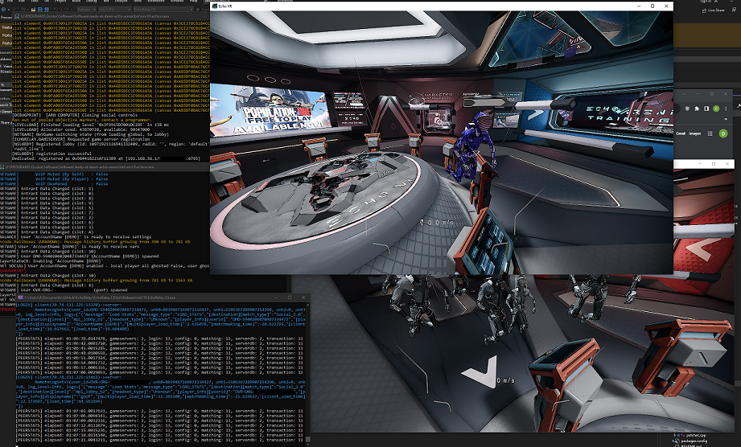

# EchoRelay.Cli

This is a simple/rough C#.NET CLI (command-line interface) app which demonstrates some of the capabilities of `EchoRelay.Core` by providing a lightweight option to deploy server resources and operate a server.

To install this component, read the installation instructions within the solution's [README](../README.md).



## Features

`EchoRelay.Cli` simply reflects the _some_ of the work done within `EchoRelay.Core`. Not all features are exposed or completed in this example.

Although this document will not expand on usage of this component in depth, sifting through surrounding READMEs and documentation should enable you to understand it well enough. 

In the least, the application was designed with some basic validation and error messages to guide you along.

Required arguments:
- `-d` or `--database`: The database folder to save server resources to. If running for the first time, should be an existing, but empty folder.

Optional arguments:
- `-g`  or `--game`: The optional path to the game (echovr.exe). Extracts symbols to the server's symbol cache during initial deployment.
- `-p` or `--port`: The TCP port to broadcast central services over.
- `--apikey`: Sets the `SERVERDB` API key to use, which game servers must connect with in their endpoint URI query parameters, to authenticate.
- `--forcematching`: Forces users to match to any available game, in the event of their requested game servers being unavailable.
- `--lowpingmatching`: Sets a preference for matching to game servers with low ping instead of high population.
- `--outputconfig`: Sets the output file path for the generated service JSON config to be saved at. This is the local config required by clients to join the server, or by game servers to register.
- `--statsinterval`: Sets the interval in milliseconds at which the CLI will output its periodic connection/peer stats over.
- `--noservervalidation`: Disables validation of game servers using raw ping requests, ensuring their ports are exposed at registration-time.
- `--servervalidationtimeout`: If `--noservervalidation` is not specified, this sets the timeout for a send/receive during the raw ping request to game servers, ensuring their ports are exposed at registration-time.
- `-v` or `--verbose`: Verbose output, includes every packet sent and received between the client and central server.

## Example commands
Most minimally, running `EchoRelay.Cli` with a `-d` (database folder to save server resources to) will get the server operating with default parameters.
```console
EchoRelay.Cli C:\database_folder\
```

Although, if you're performing your first initial setup (an empty database folder), you may specify `-g` pointing to the game folder, so you can extract symbols from the game to the symbol cache.
```console
EchoRelay.Cli -d "C:\database_folder\" -g "C:\Oculus\Software\ready-at-dawn-echo-arena\bin\win10\echovr.exe"
```

For verbose output for every message sent between client and server, use `-v`:
```console
EchoRelay.Cli -v -d "C:\database_folder\" -g "C:\Oculus\Software\ready-at-dawn-echo-arena\bin\win10\echovr.exe"
```

## Known issues

- There is probably a lack of validation on some arguments like `--port` and `--servervalidationtimeout`.
- This app was written very rapidly without use of a real CLI parsing framework or much testing. It wouldn't be surprising to know it has a silly bug beyond that.